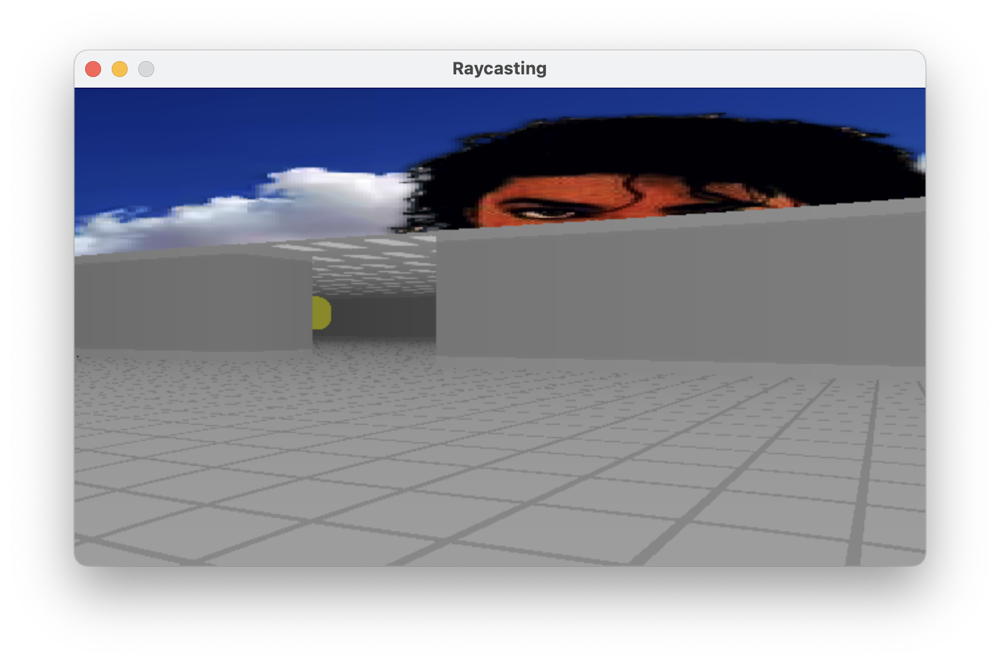
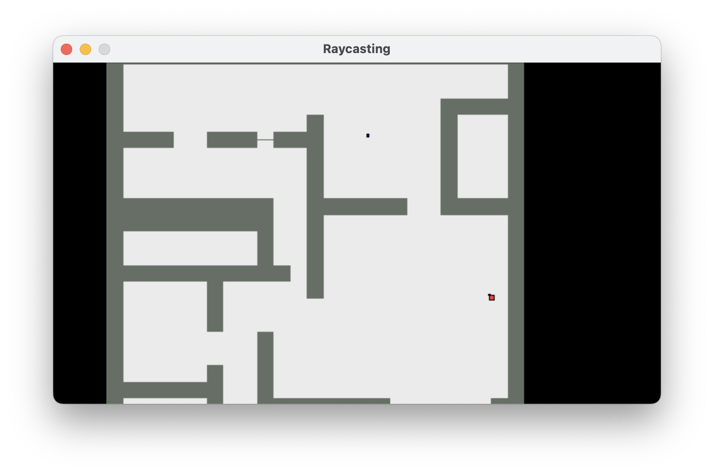
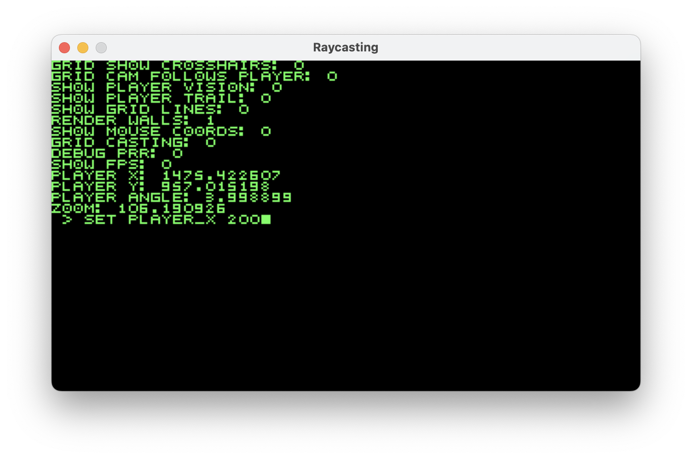

## Raycasting Engine

Uses the graphics library SDL3 with a raycasting algorithm to simulate a 3D space in a 2D plane. A demo of the project can be found [here](https://nathanallison0.github.io).

## Features:
- A two-dimensional map that can be traversed by the player in first person
- Customizable sprites that inhabit the world
- A top-down view where the camera can move independently from the player
- Textures for the walls, floor, and ceiling, including a sky texture
- A terminal for debugging where the user can make save states and change variables during runtime

## Planned features:
- A dynamic lighting system designed for the grid layout of the project
- Enemies that target the player and can be defeated
- An example game made within the engine

## Main files:
- [Main project file](realRaycast/realRaycast.c)
- [Raycasting algorithm](realRaycast/raycasts.h)
- [Custom terminal creation](DebugTerminal/DebugTerminal.h)

**First person view:**\

**Top-down view:**\

**Terminal:**\

